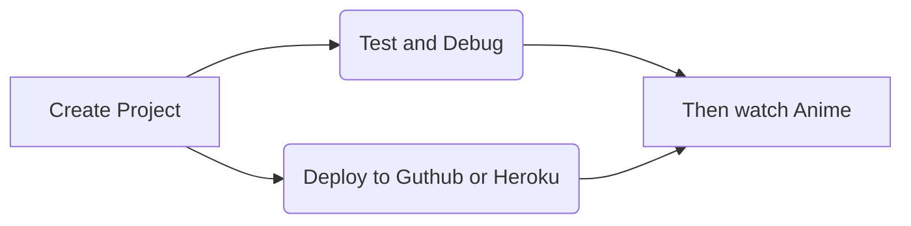

# Code Ninja-tech

👋 Hey there I'm the **Code Ninja**.
14 | year old Fullstack web developer 🤘
Enthusiastic and Nice
**Otaku** and **Anime** fan
Gamer
 Artist
I enjoy writing javascript code most especially with **React Js** and **Typescript**
> 

> **Life Quote:**  `"In the middle of every difficulty lies opportunity."`

## WEB DEVLOPER LANGUAGES

|                |Client side development                     |Server side development                        |
|----------------|-------------------------------|-----------------------------|
|90%|`'HTML'`            |`'PHP & SQL'`           |
|88%          |`"CSS"`            |`'Node & Npm'`       |
|74%          |`"Javascript"`            |`'Git CLI & version control'`	           |
|97%          |`"Bootstrap"`            |`'Python'`          |
|90%          |`"React JS"`            |`'Mongo DB'`         |
|90%          |`"Vue JS"`            |`'Firebase'`          |
|70%          |`"Typescript"` 
|95%          |`"Tailwind"` 
|98%          |`"jQuery` 

>More Python === Global Warming
>
>--Just kidding.

## Upcoming Projects

 1.   Build a discord clone using [ react js](https://reactjs.org), which will have 	    core functionlities and similar UI/UX
 2.  Create a [twitter](https://twitter,com) clone with real-time authentication and server side functionalities.
 3.  Build a web app anime streaming service like [crunchyroll](crunchyroll.com) which will be able to get anime lists from external servers and provide basic streaming qualities.

My usual work flow : 

